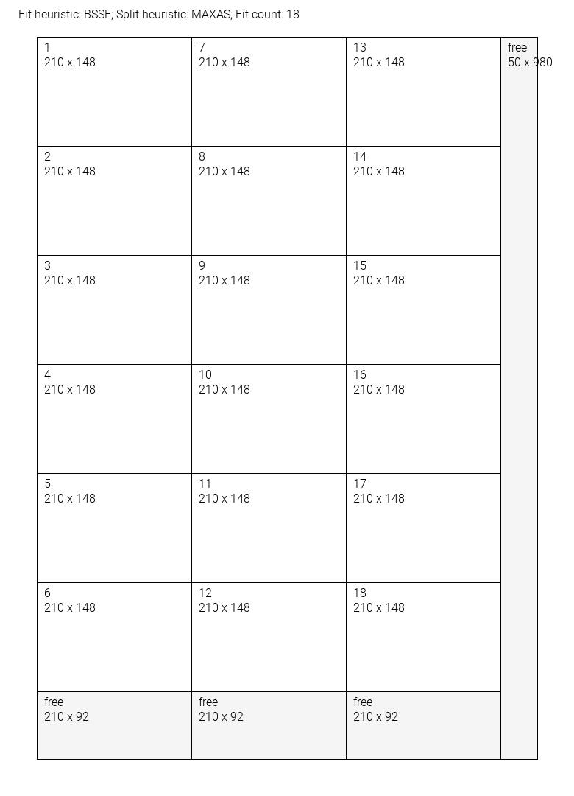
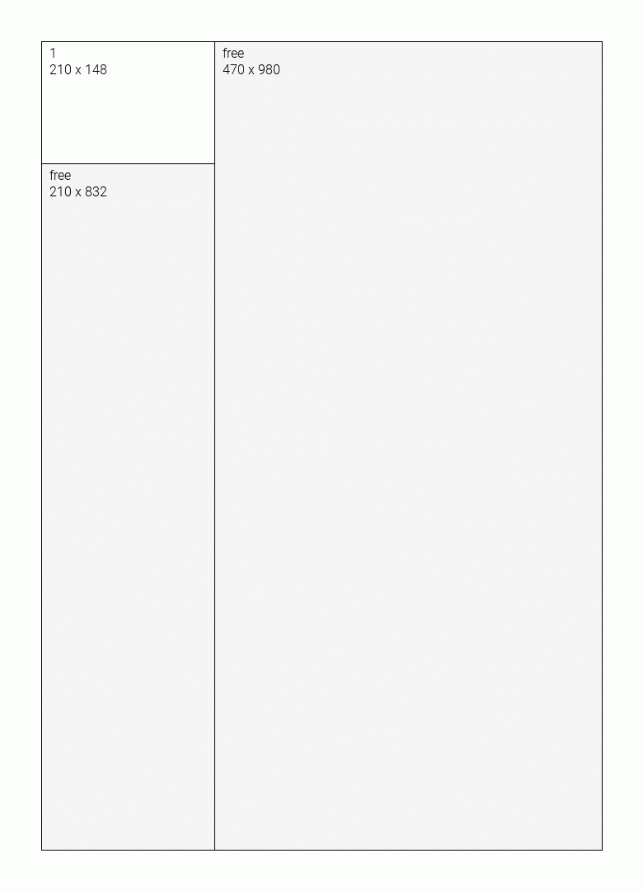

# bin-packer
2D bin packing for PHP, with rotation and growth function

## Usage
### Basic

```php
$fitHeuristic = new BestShortSideFit();
$splitHeuristic = new MaximizeAreaSplit();

$binPacker = new BinPacker($fitHeuristic, $splitHeuristic);

$bin = new Bin(680, 980);
$blocks = [];

for ($i = 0; $i < 30; $i++) {
    $blocks[] = new Block(148, 210, true, $i + 1);
}

$state = $binPacker->pack($bin, $blocks);
```

#### Determining the result (was a block packed?)

```php
foreach ($blocks as $block) {
    if ($block->getNode() && $block->getNode()->isUsed()) {
        // packed
    }
}
```

Or the other way around:

```php
foreach ($state->getUsedNodes() as $node) {
    if ($node->isUsed()) {
        $node->getBlock(); // packed block
    }
}
```


### Rotation

By default, all blocks are allowed to rotate. Rotation occurs only if a fit is not found with the initial orientation.

You can disable rotation by passing `false` as the 3rd parameter to the block's constructor.
```php
new Block(100, 100, false);
```

### Identifying blocks

Sometimes it can be useful to set an identifier for the block. The optional 4th parameter of the constructor is the block ID.

```php
new Block(100, 100, false, 'My id, can be anything.');
```

### Bin growth

By allowing the bin to grow, you can fit all blocks, every time.

You can enable growth by passing `true` as the 3rd parameter to the bin's constructor.
```php
$bin = new Bin(1000, 1000, true);
```

## Visualizer

You can use the visualizer to create pictures of the packed bin.

```php
$state = //...;

$visualizer = new Visualizer();

$image = $visualizer->visualize($bin, $state);
```

This feature uses the GD extension, and returns a `\GdImage` class. You can use the result to save, or display the image.

```php
ob_start();

imagejpeg($image);
$content = ob_get_contents();

ob_end_clean();


file_put_contents($filename, $content);
```



## GIF creator

**WARNING**
The GIF creators performance is relatively slow. I would suggest only using it for debug purposes, or non real-time scenarios.

```php
$gifMaker = new GifMaker(new Visualizer());
$state = $binPacker->pack($bin, $blocks, $gifMaker);

$gif = $gifMaker->create();
$gif->writeImages($filename, true);
```


